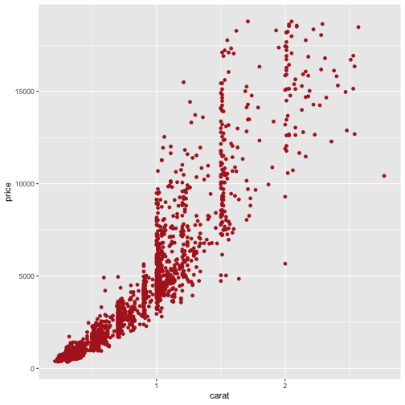
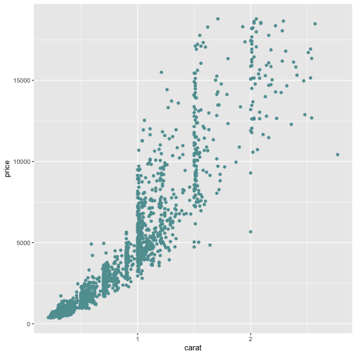
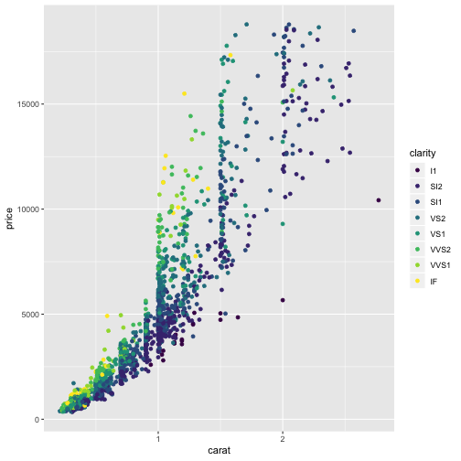

Summary of Pilot Results
========================================================
author: 
date: 
autosize: true
font-import: http://fonts.googleapis.com/css?family=Open+Sans
font-family: 'Open Sans'
<!-- transition: rotate -->

Test slide
========================

First Slide
========================================================
type: exclaim
For more details on authoring R presentations please visit <https://support.rstudio.com/hc/en-us/articles/200486468>.

- Bullet 1
- Bullet 2
- Bullet 3

Slide With Plot
========================================================
title: false

This text is my footer text 
Normally, the top of the text block would appear 90% of the way down the slide (i.e., at the bottom), because that is how the 'top' property is defined in the 'footer' style. However this particular footer wraps onto multiple lines, so we shift it up by specifying a negative value for the 'margin-top' property.

First plot

*** 
Second plot

