

Summary of Pilot Results
========================================================
author: 
date: 
autosize: true
font-import: http://fonts.googleapis.com/css?family=Open+Sans
font-family: 'Open Sans'

Outside the rooms - Item memory
========================================================
type: noborder
**Novelty effects on mean hit rate**

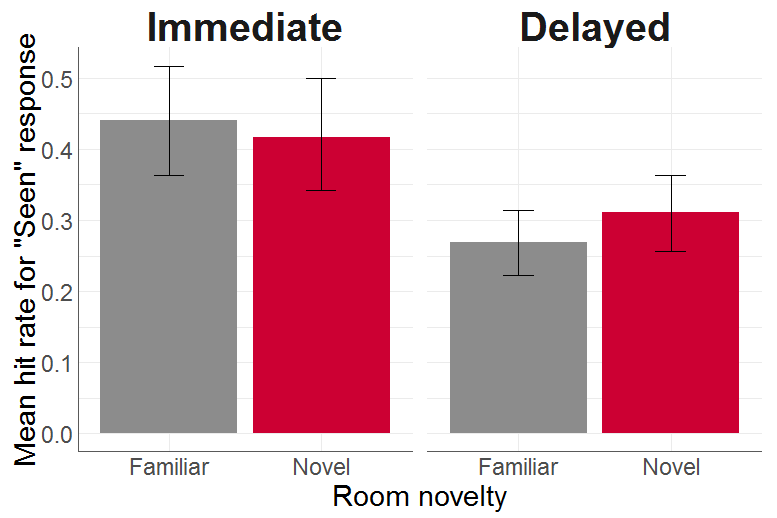

Outside the rooms
========================================================
title: false
type: noborder
**Hit rate as a function of item order**

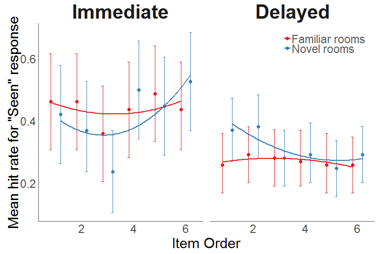

Outside the room
========================================================
title: false
type: noborder
**Collapse "early" (1st - 3rd) and "late" (4th - 6th) item orders**

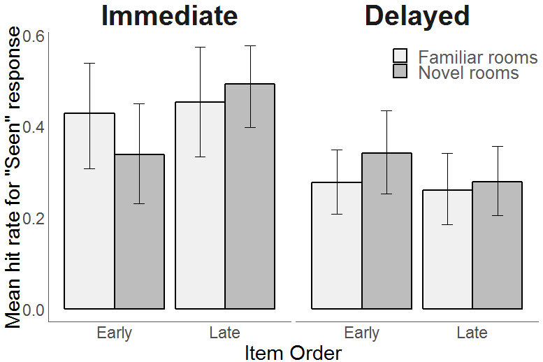

Outside the rooms
========================================================
title: false
type: noborder
**Curiosity effects on mean hit rate**

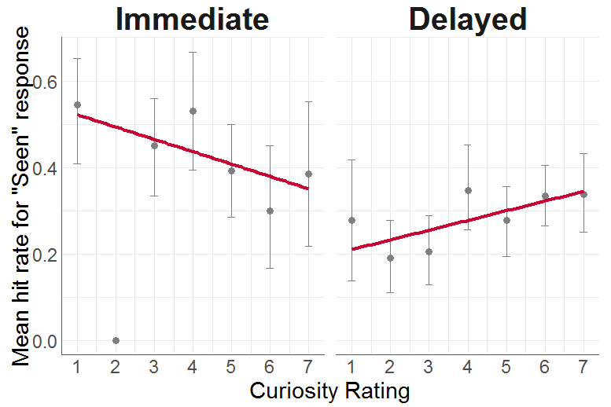

Outside the rooms
========================================================
title: false
type: noborder
**Curiosity effects as a function of item order**

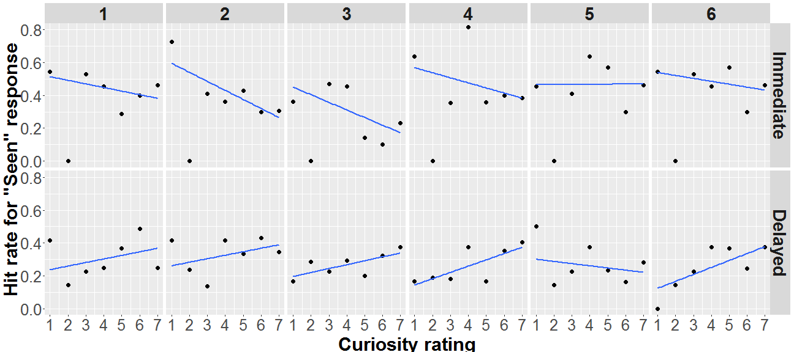

Outside the room
========================================================
title: false
type: noborder
**Collapse "low" (1 - 3) and "high" (5 - 7) curiosity rating**

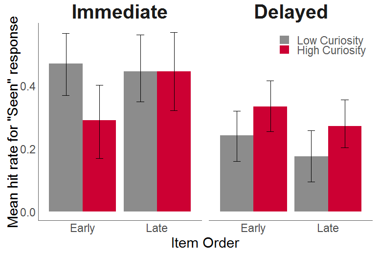

Outside the rooms - Context memory
========================================================
type: noborder
**Novelty effects on mean accuracy of context memory**

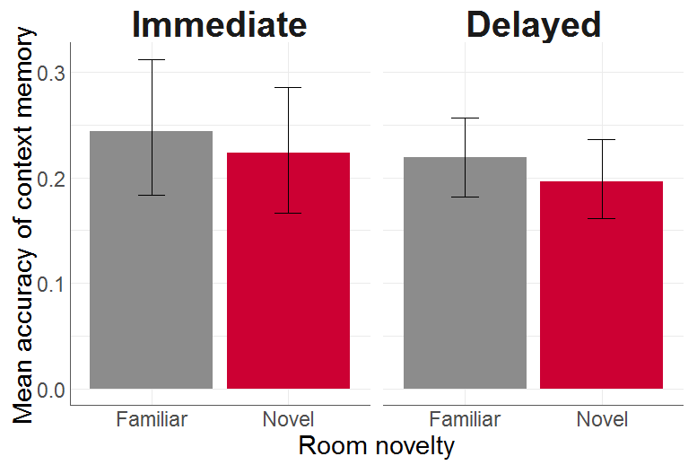

Outside the rooms
========================================================
title: false
type: noborder
**Accuracy of context memory as a function of item order**

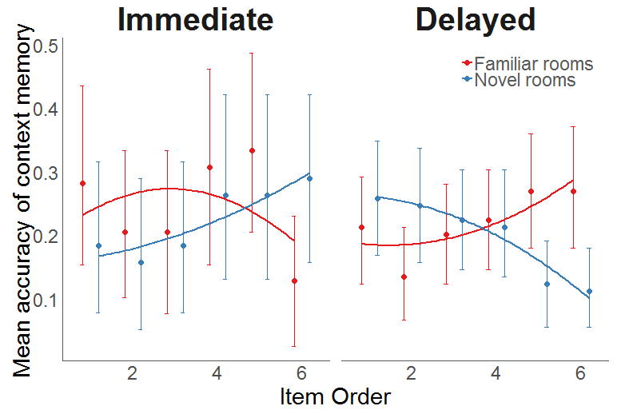

Outside the room
========================================================
title: false
type: noborder
**Collapse "early" (1st - 3rd) and "late" (4th - 6th) item orders**

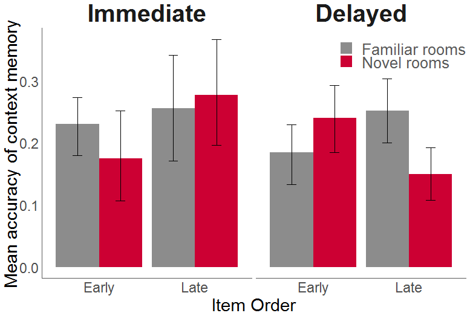

Outside the rooms
========================================================
title: false
type: noborder
**Curiosity effects on mean accuracy of context memory**

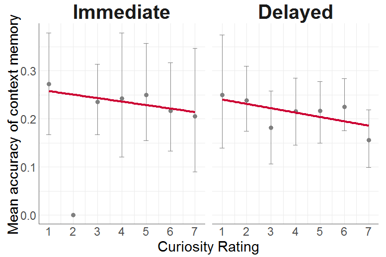

Outside the rooms
========================================================
title: false
type: noborder
**Curiosity effects as a function of item order**

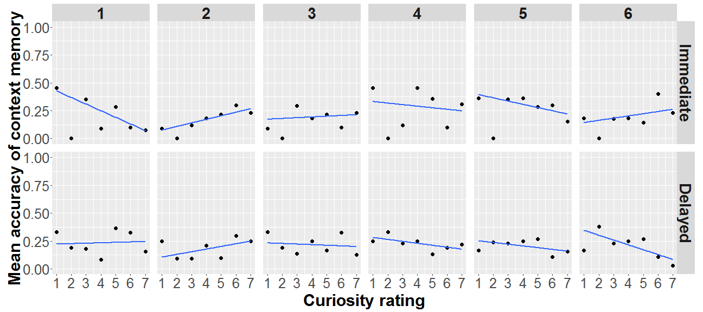

Outside the room
========================================================
title: false
type: noborder
**Collapse "low" (1 - 3) and "high" (5 - 7) curiosity rating**

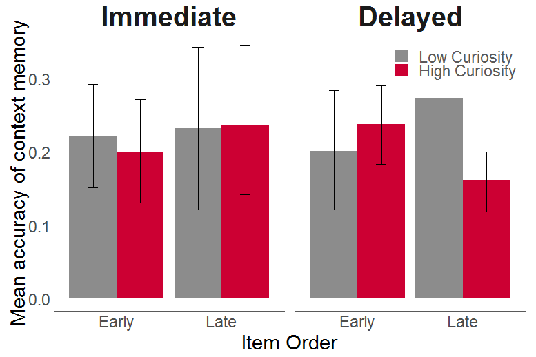

Inside the rooms - Item memory
========================================================
type: noborder
**Novelty effects on mean hit rate**

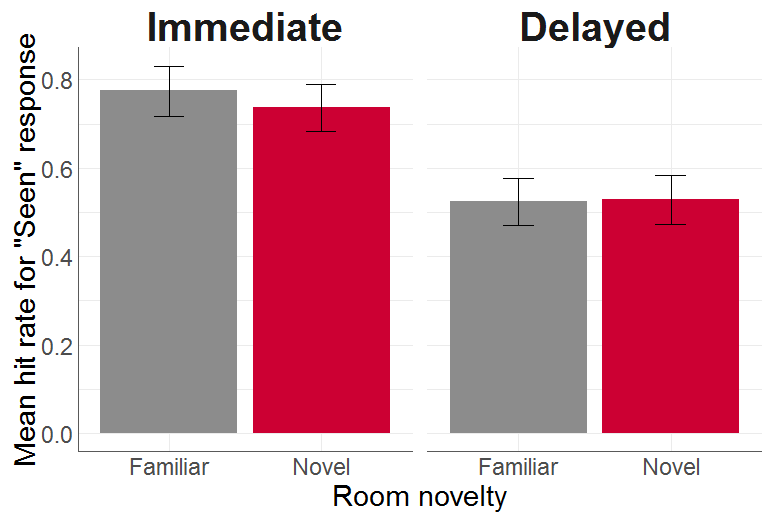

Inside the rooms
========================================================
title: false
type: noborder
**Hit rate as a function of item order**

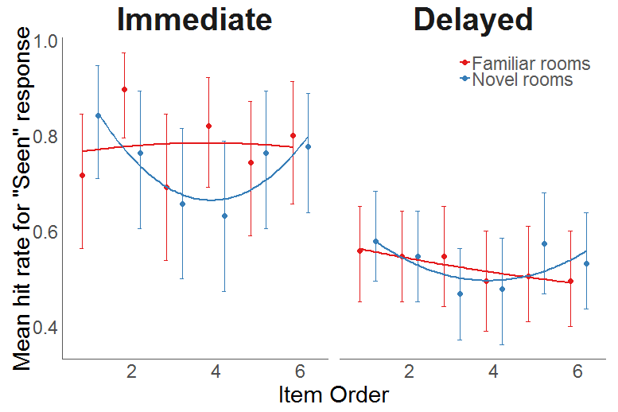

Inside the room
========================================================
title: false
type: noborder
**Collapse "early" (1st - 3rd) and "late" (4th - 6th) item orders**

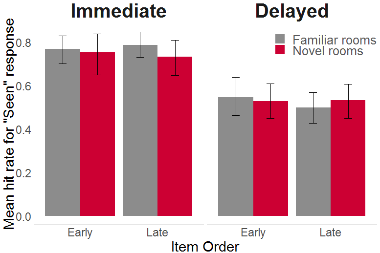

Inside the rooms
========================================================
title: false
type: noborder
**Curiosity effects on mean hit rate**

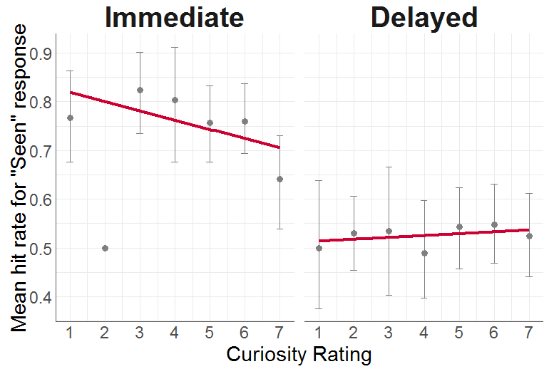

Inside the rooms
========================================================
title: false
type: noborder
**Curiosity effects as a function of item order**

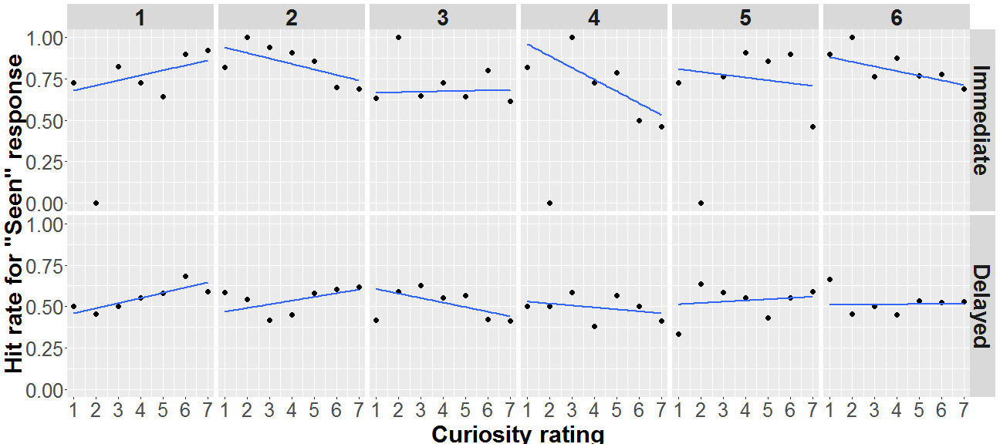

Inside the room
========================================================
title: false
type: noborder
**Collapse "low" (1 - 3) and "high" (5 - 7) curiosity rating**

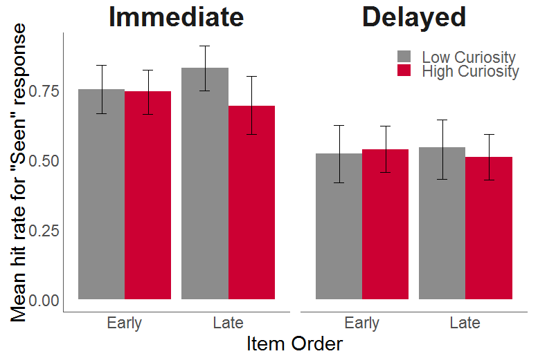

Inside the rooms - Context memory
========================================================
type: noborder
**Novelty effects on mean accuracy of context memory**

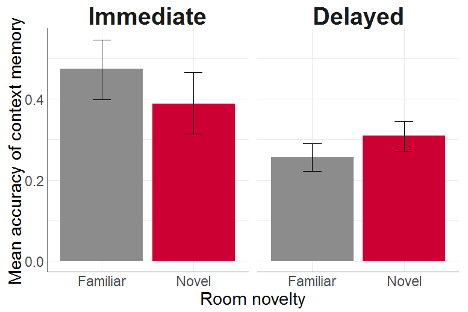

Inside the rooms
========================================================
title: false
type: noborder
**Accuracy of context memory as a function of item order**

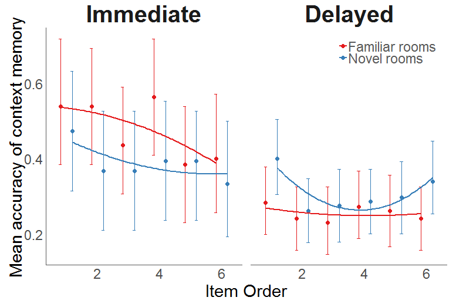

Inside the room
========================================================
title: false
type: noborder
**Collapse "early" (1st - 3rd) and "late" (4th - 6th) item orders**

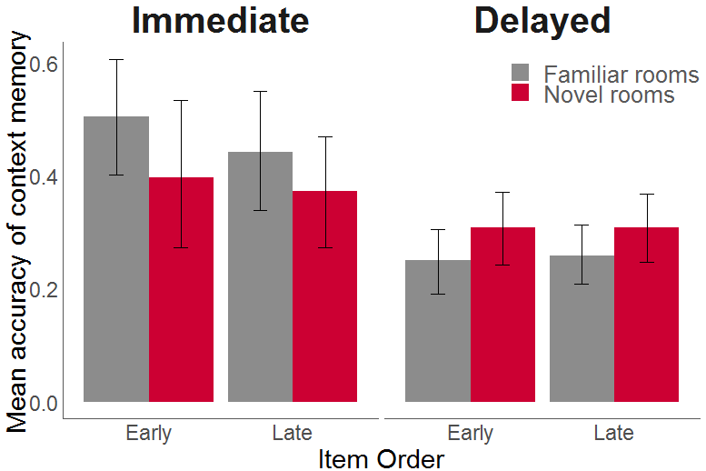

Inside the rooms
========================================================
title: false
type: noborder
**Curiosity effects on mean accuracy of context memory**

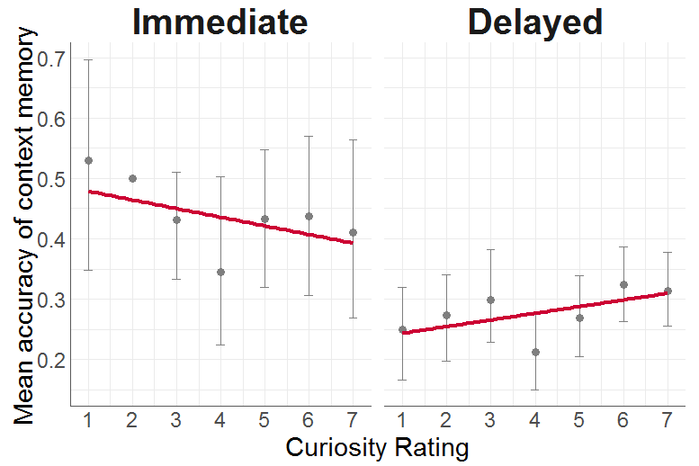

Inside the rooms
========================================================
title: false
type: noborder
**Curiosity effects as a function of item order**

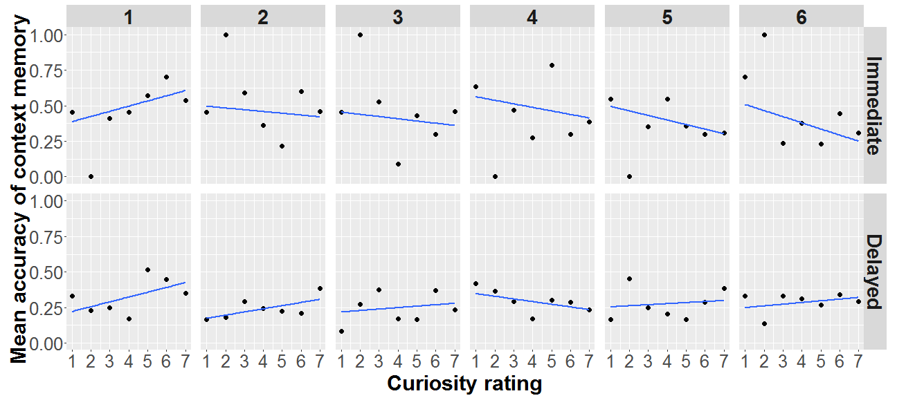

Inside the room
========================================================
title: false
type: noborder
**Collapse "low" (1 - 3) and "high" (5 - 7) curiosity rating**

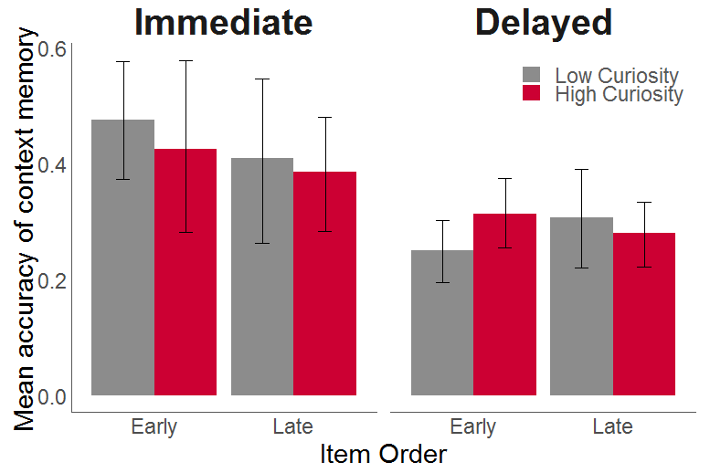
